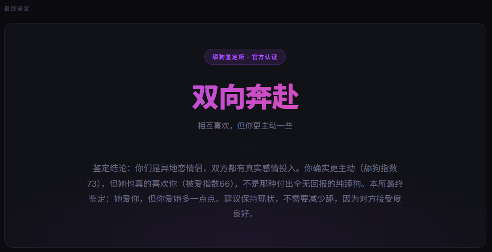

<div align="center">


<br/>

[](LICENSE)
[]()
[]()
[](https://github.com/shuakami/qq-chat-exporter)
[](https://github.com/863401402/she-love-me)
[](https://claude.ai/code)
[](https://developers.openai.com/codex/overview)
[](https://cursor.sh)
[](https://github.com/863401402/she-love-me/pulls)

[快速开始](#快速开始) · [功能特性](#功能特性) · [工作原理](#工作原理) · [致谢](#致谢)

</div>

---

## 简介

**她爱我吗？** 是一个**通用 Agent Skill**，支持 Claude Code、Codex、Cursor、GitHub Copilot、Gemini CLI 等主流 AI 编程工具。

只需要一句调用指令（例如 Claude 里输入 `/she-love-me`，Codex 里输入 `$she-love-me`），它就能自动解密你的微信数据库（或通过 QCE 提取 QQ 记录）、分析你和某个联系人的全部聊天记录，然后告诉你：**这段关系里，谁更在意？她真的爱你吗？**

v2.0 起融入专业心理学框架，不只给结论——还做**依恋类型诊断**、**Gottman 关系健康检测**、**危险信号预警**，并以军师身份给出具体可执行的建议。

v2.2 起支持 **QQ 聊天记录分析**（通过 [QQ Chat Exporter](https://github.com/shuakami/qq-chat-exporter)），微信与 QQ 统一流程，同一份报告。

> 分析全程在本地运行，数据不上传任何服务器。

---

## 输出效果

> *(首次运行后，在 `reports/` 目录用浏览器打开 HTML 报告)*

### 鉴定指数

```
📊 主动指数   73 ████████░░  你发起对话 72%，偶尔连轰 767 次
💜 被爱指数   66 ███████░░░  她凌晨 3 点发了 8 条消息说想你
🧊 冷淡指数   28 ███░░░░░░░  回复速度 8 分钟，态度还行
```

### 报告截图

> 📸 *截图示例（以真实运行结果为准）*

| 成分表 | 数据面板 | 趋势图表 |
|:---:|:---:|:---:|
|  |  |  |

| 最终鉴定结果 |
|:---:|
|  |
---

## 功能特性

| 功能 | 说明 |
|------|------|
| 🔓 **自动解密** | 自动 clone 并调用 wechat-decrypt，无需手动操作 |
| 👥 **联系人选择** | 按消息数量排列，选你想分析的那个人 |
| 📊 **主动指数** | 主动发起占比 · 连续轰炸次数 · 回复速度差 · 消息长度比 |
| 💜 **被爱指数** | 对方主动次数 · 晚安/早安分析 · 关心频率 |
| 🧊 **冷淡检测** | "嗯""哦""好" 占比 · 长时间已读不回统计 |
| 📊 **话语权分析** | 谁在主导对话，谁在迎合；权力动态量化 |
| 📈 **趋势图表** | 每日消息量 · 活跃时段 · 双方占比（Chart.js） |
| 🧠 **依恋类型诊断** | 安全型 / 焦虑型 / 回避型 / 恐惧型，双方都分析 |
| 🔄 **追逃循环复盘** | 还原完整"案发现场"：触发→撤退→升级→恶化 |
| 💘 **Sternberg 三角** | 激情 · 亲密 · 承诺三维评分，判断爱情类型 |
| 🩹 **修复尝试分析** | 冷战后谁低头？对方接受还是继续惩罚？ |
| 💡 **情感可得性评估** | 对方此刻是否真的有能力投入这段关系 |
| ⚠️ **危险预警** | 煤气灯效应 · 爱情轰炸 · 间歇性强化 · 单相思痴迷等 7 类信号 |
| 🎯 **军师模式** | 核心诊断 + 停止/开始建议（含时机）+ 路线图 + **止损红线** |
| 🔍 **AI 深度鉴定** | Agent 读取全量消息，结合统计数据给出有洞察力的结论 |
| 📄 **双格式输出** | 终端 Markdown 摘要 + 可分享的 HTML 报告 |

---

## 快速开始

### 前置条件

**微信分析**：
- Windows / macOS + WeChat 4.0+（**必须处于登录运行状态**）
- Windows 需要使用**管理员终端**
- macOS 请确保终端具备必要系统权限，并按上游解密器提示授权

**QQ 分析（v2.2 新增）**：
- 安装并启动 [QQ Chat Exporter (QCE)](https://github.com/shuakami/qq-chat-exporter)（NapCat + QCE 插件）
- 用手机 QQ 扫码登录，获取控制台显示的 Access Token
- 无需管理员权限，无需解密步骤

**通用**：
- 任意一个支持 Skill 或 `AGENTS.md` 的 AI 编程工具（见下方）

### 安装

```bash
git clone https://github.com/863401402/she-love-me
cd she-love-me
```

根据你使用的 AI 工具，启动对应的 Agent：

| 工具 | Skill 格式 | 启动方式 | 调用方式 |
|------|-----------|----------|----------|
| [Claude Code](https://claude.ai/code) | `.claude/skills/` | `claude` | `/she-love-me` |
| [OpenClaw](https://openclaw.ai) | `.claude/skills/` | `openclaw`（管理员） | `/she-love-me` |
| [Codex](https://developers.openai.com/codex/overview) | `.agents/skills/` + `AGENTS.md` | 打开项目，或在仓库根目录运行 `codex` | `$she-love-me`，或直接说“使用 she-love-me 分析聊天记录” |
| [Cursor](https://cursor.sh) | `.agents/skills/` | 打开项目文件夹 | `/she-love-me` |
| [GitHub Copilot](https://github.com/features/copilot) | `.agents/skills/` | 打开 VS Code | `/she-love-me` |
| [Gemini CLI](https://github.com/google-gemini/gemini-cli) | `.agents/skills/` | `gemini` | `/she-love-me` |

> Skill 文件位于 `.claude/skills/she-love-me/SKILL.md`（Claude Code / OpenClaw）和 `.agents/skills/she-love-me/SKILL.md`（Codex / Cursor / Copilot / Gemini CLI）。Codex 还会读取仓库根目录的 `AGENTS.md`，并识别 `.agents/skills/she-love-me/agents/openai.yaml` 中的元数据。

### 运行

Claude Code / OpenClaw / Cursor / Copilot / Gemini CLI：

```text
/she-love-me
```

Codex：

```text
$she-love-me
```

也可以直接说一句自然语言，例如：`使用 she-love-me 分析微信聊天记录`。

**就这些。** Skill 会先询问平台（微信 / QQ），然后自动处理一切：

**微信流程：**
```
调用 she-love-me Skill
  ↓
运行 setup_check.py → 自动 clone wechat-decrypt → pip install 依赖
  ↓
扫描微信内存 → 提取密钥 → 解密 19 个数据库
  ↓
展示联系人列表 → 你选择分析对象
  ↓
提取消息 → 统计计算 → AI 深度鉴定
  ↓
关系诊断 · 依恋类型 · 危险预警 · 军师建议
  ↓
生成 HTML 报告 + 终端摘要
```

**QQ 流程（v2.2）：**
```
调用 she-love-me Skill
  ↓
输入 QCE Access Token（需提前启动 NapCat + QCE）
  ↓
通过 API 获取 QQ 好友列表 → 你选择分析对象
  ↓
提取消息 → 统计计算 → AI 深度鉴定
  ↓
关系诊断 · 依恋类型 · 危险预警 · 军师建议
  ↓
生成 HTML 报告 + 终端摘要
```

---

## 工作原理

**微信路径：**
```
WeChat 4.0（运行中）
    │
    │  内存扫描，提取 SQLCipher4 密钥
    ▼
wechat-decrypt（自动 clone）
    │
    │  解密 19 个数据库文件
    ▼
标准 SQLite 文件（contact.db · message_N.db · session.db）
    │
    │  scripts/ 统计分析引擎
    ▼
主动指数 / 被爱指数 / 成分表 / 趋势数据
    │
    │  AI Agent：Sternberg 三角 · Gottman 四骑士 · 依恋类型
    │            权力动态 · 情感可得性 · 危险预警 · 军师建议
    ▼
HTML 报告（暗色现代风格）+ Markdown 摘要
```

**QQ 路径（v2.2）：**
```
NapCat + QCE 插件（用户手动启动，扫码登录）
    │
    │  REST API：GET /api/friends · POST /api/messages/export
    ▼
scripts/extract_messages_qq.py（API 调用 + 格式转换）
    │
    │  统一为 messages.json 格式
    ▼
scripts/ 统计分析引擎（与微信共用）
    │
    │  AI Agent 深度鉴定
    ▼
HTML 报告 + Markdown 摘要
```

**微信解密部分完全依赖 [ylytdeng/wechat-decrypt](https://github.com/ylytdeng/wechat-decrypt)，QQ 导出部分依赖 [shuakami/qq-chat-exporter](https://github.com/shuakami/qq-chat-exporter)，本项目不包含任何解密代码，只调用其公开接口。**

---

## 项目结构

```
she-love-me/
├── AGENTS.md                  # Codex 仓库级说明与调用约定
├── .claude/
│   ├── settings.json           # Skill 注册配置
│   └── skills/
│       └── she-love-me/
│           └── SKILL.md        # Skill 入口（Claude Code / OpenClaw）
├── .agents/
│   └── skills/
│       └── she-love-me/
│           ├── SKILL.md        # Skill 入口（Codex / Cursor / Copilot / Gemini CLI）
│           └── agents/
│               └── openai.yaml # Codex 元数据（显示名 / 默认提示 / 品牌色）
├── scripts/
│   ├── setup_check.py          # 跨平台环境检查 / 依赖准备 / 微信进程检测
│   ├── decrypt_wechat.py       # 跨平台解密入口（macOS 走 C 扫描器）
│   ├── list_contacts.py        # 列出微信联系人（按消息数排序）
│   ├── list_contacts_qq.py     # 列出 QQ 好友（通过 QCE API）
│   ├── extract_messages.py     # 提取微信消息
│   ├── extract_messages_qq.py  # 提取 QQ 消息（通过 QCE API，转换为统一格式）
│   ├── stats_analyzer.py       # 统计分析引擎（微信/QQ 共用）
│   └── generate_html_report.py # 生成 HTML 报告（微信/QQ 共用）
├── vendor/                     # wechat-decrypt 自动 clone 到这里（gitignore）
├── data/                       # 分析中间数据（gitignore）
├── reports/                    # 生成的 HTML 报告（gitignore）
├── assets/                     # README 截图
├── requirements.txt
└── LICENSE
```

---

## 支持平台

| 平台 | 微信 | QQ | 备注 |
|------|------|-----|------|
| Windows | ✅ 支持 | ✅ 支持 | 微信需要管理员终端；QQ 无需管理员 |
| macOS | 🧪 实验性 | ✅ 支持 | 微信依赖上游 wechat-decrypt 与本机权限配置 |
| Linux | 🔜 规划中 | ✅ 支持 | QQ 通过 Docker NapCat 部署可用 |

---

## 版本规划

- **v1.0**：文字消息分析 · HTML 报告 · 主动/被爱/冷淡指数
- **v2.0**：依恋类型诊断 · Sternberg 三角 · Gottman 四骑士 · 危险预警 · 军师模式
- **v2.1**：核心恐惧分析 · 情感可得性评估 · 权力动态量化 · 修复尝试分析 · 追逃循环复盘 · 止损红线 · 时机指引
- **v2.2**（当前）：**QQ 聊天记录支持**（通过 QQ Chat Exporter API）· 微信/QQ 统一分析管线 · 无需解密直接通过 API 导出
- **v3.0**（规划）：语音消息转文字分析 · 图片表情包分析 · Linux 支持完善

---

## 社区支持

<div align="center">

**学 AI，上 L 站**

[](https://linux.do)

本项目在 [LINUX DO](https://linux.do) 社区发布与交流，感谢佬友们的支持与反馈。

</div>

---

## 致谢

本项目的微信数据库解密能力完全来自：

> **[ylytdeng/wechat-decrypt](https://github.com/ylytdeng/wechat-decrypt)**
>
> WeChat 4.0 database decryptor — 通过内存扫描提取 SQLCipher4 密钥，实时解密微信数据库。
> 没有这个项目，本工具无从实现。感谢作者的开源贡献 🙏

---

## 免责声明

- 本工具**仅供娱乐**，鉴定结果不构成任何情感建议
- **仅用于分析你自己的微信数据**，请勿侵犯他人隐私
- 所有数据处理在本地完成，不上传至任何服务器
- 使用前请确认当地法律法规

---

## 交流群

<div align="center">


*扫码加入微信交流群，遇到问题、分享鉴定结果、更新优化方向都可以聊*

</div>

---

<div align="center">

**MIT License © 2026 她爱我吗？恋情分析室**

*如果这个项目帮你想通了什么，记得给个 ⭐*

</div>
